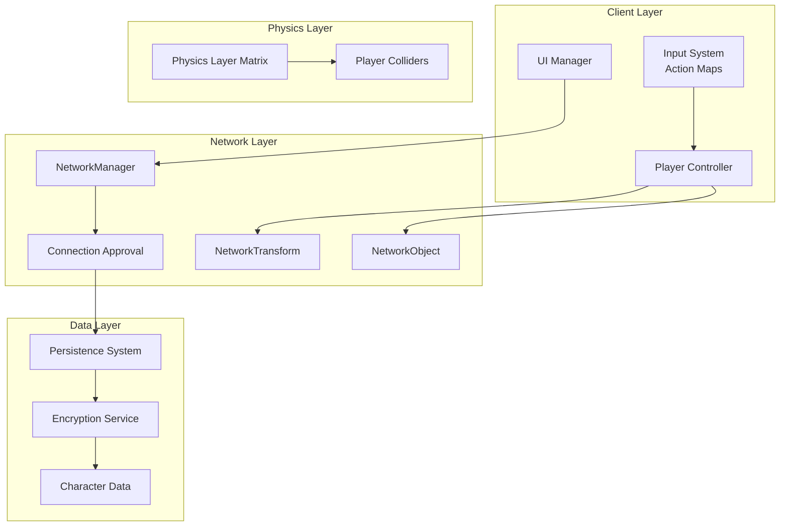
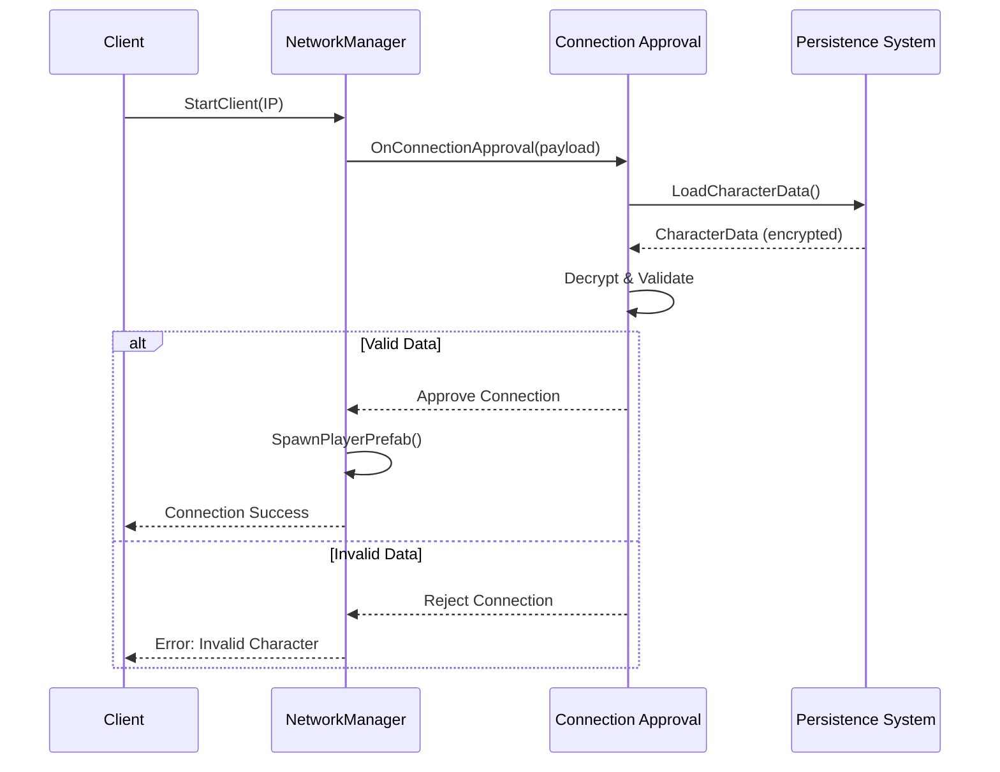

# Design Document: Network Player Foundation

## Overview

Este documento define la arquitectura técnica para el sistema fundacional de red y movimiento de jugadores de "The Ether Domes". El diseño implementa un modelo híbrido Host-Play/Servidor Dedicado usando Unity Netcode for GameObjects (NGO), permitiendo sesiones cooperativas de 1-10 jugadores con persistencia local encriptada y validación anti-cheat.

La arquitectura sigue el patrón de autoridad de cliente para movimiento (client-authoritative movement) con validación server-side para datos críticos, balanceando responsividad con seguridad.

## Architecture



### Flujo de Conexión



## Components and Interfaces

### NetworkSessionManager

Wrapper sobre NetworkManager de NGO que expone una API simplificada para gestión de sesiones.

```csharp
public interface INetworkSessionManager
{
    // Session Management
    void StartAsHost(ushort port = 7777);
    void StartAsClient(string ipAddress, ushort port = 7777);
    void StartAsDedicatedServer(ushort port = 7777);
    void Disconnect();
    
    // Events
    event Action<ulong> OnPlayerConnected;
    event Action<ulong> OnPlayerDisconnected;
    event Action<string> OnConnectionFailed;
    
    // State
    bool IsHost { get; }
    bool IsClient { get; }
    bool IsServer { get; }
    int ConnectedPlayerCount { get; }
    int MaxPlayers { get; } // Returns 10
}
```

### ConnectionApprovalHandler

Implementa la validación de datos de personaje durante el proceso de conexión.

```csharp
public interface IConnectionApprovalHandler
{
    // Validation
    ConnectionApprovalResult ValidateConnectionRequest(byte[] payload);
    
    // Configuration
    TimeSpan ValidationTimeout { get; set; }
}

public struct ConnectionApprovalResult
{
    public bool Approved;
    public string RejectionReason;
    public ApprovalErrorCode ErrorCode;
}

public enum ApprovalErrorCode
{
    None = 0,
    InvalidDataFormat = 1,
    CorruptedData = 2,
    StatsOutOfRange = 3,
    ValidationTimeout = 4,
    EncryptionFailure = 5
}
```

### PlayerController

Controlador de movimiento con verificación de ownership.

```csharp
public interface IPlayerController
{
    // Movement
    void ProcessMovementInput(Vector2 input);
    void SetMovementSpeed(float speed);
    
    // State
    bool IsOwner { get; }
    Vector3 CurrentVelocity { get; }
}
```

### CharacterPersistenceService

Gestiona la persistencia local encriptada de datos de personaje.

```csharp
public interface ICharacterPersistenceService
{
    // Save/Load
    Task<bool> SaveCharacterAsync(CharacterData data);
    Task<CharacterData> LoadCharacterAsync(string characterId);
    
    // Validation
    bool ValidateCharacterIntegrity(CharacterData data);
    
    // Cross-World
    byte[] ExportCharacterForNetwork(CharacterData data);
    CharacterData ImportCharacterFromNetwork(byte[] payload);
}

public class CharacterData
{
    public string CharacterId;
    public string CharacterName;
    public int Level;
    public EquipmentData Equipment;
    public byte[] IntegrityHash;
}
```

### InputBindingService

Gestiona los bindings de input usando Unity Input System.

```csharp
public interface IInputBindingService
{
    // Binding Management
    void RebindAction(string actionName, string bindingPath);
    string GetCurrentBinding(string actionName);
    void ResetToDefaults();
    
    // Persistence
    void SaveBindings();
    void LoadBindings();
    
    // Validation
    bool HasConflict(string actionName, string newBinding);
    List<string> GetConflictingActions(string binding);
}
```

## Data Models

### CharacterData

```csharp
[Serializable]
public class CharacterData
{
    public string CharacterId;          // GUID único
    public string CharacterName;        // Nombre visible
    public int Level;                   // 1-100
    public CharacterClass Class;        // Enum de clase
    public EquipmentData Equipment;     // Equipo actual
    public Vector3 LastPosition;        // Última posición conocida
    public string LastWorldId;          // ID del último mundo visitado
    public DateTime LastSaveTime;       // Timestamp de guardado
    public byte[] IntegrityHash;        // Hash para validación
}

[Serializable]
public class EquipmentData
{
    public ItemData[] EquippedItems;    // Array de items equipados
    public int TotalArmorValue;         // Valor calculado de armadura
    public int TotalDamageBonus;        // Bonus de daño total
}

[Serializable]
public class ItemData
{
    public string ItemId;
    public string ItemName;
    public int ItemLevel;
    public ItemRarity Rarity;
    public Dictionary<string, int> Stats;  // Stats del item
    public bool IsBound;                    // Si está ligado al personaje
}
```

### NetworkPayload

```csharp
[Serializable]
public class ConnectionPayload
{
    public byte[] EncryptedCharacterData;
    public string ClientVersion;
    public byte[] ClientSignature;
}
```

### InputBindingData

```csharp
[Serializable]
public class InputBindingData
{
    public Dictionary<string, string> ActionBindings;  // ActionName -> BindingPath
    public DateTime LastModified;
}
```

## Correctness Properties

*A property is a characteristic or behavior that should hold true across all valid executions of a system—essentially, a formal statement about what the system should do. Properties serve as the bridge between human-readable specifications and machine-verifiable correctness guarantees.*

### Property 1: Session State Consistency

*For any* session start operation (Host, Client, or DedicatedServer), the resulting state flags (IsHost, IsClient, IsServer) SHALL be mutually consistent:
- Host: IsHost=true, IsClient=true, IsServer=true
- Client: IsHost=false, IsClient=true, IsServer=false
- DedicatedServer: IsHost=false, IsClient=false, IsServer=true

**Validates: Requirements 1.1, 1.3**

### Property 2: Player Count Enforcement

*For any* session with N connected players where N >= MaxPlayers (10), subsequent connection attempts SHALL be rejected.

**Validates: Requirements 1.6**

### Property 3: Ownership-Based Input Processing

*For any* PlayerController instance and any movement input, if IsOwner is false, the input SHALL be ignored and CurrentVelocity SHALL remain unchanged.

**Validates: Requirements 3.1, 3.2**

### Property 4: Eight-Direction Movement Validity

*For any* Vector2 movement input, the resulting normalized movement direction SHALL be one of exactly 9 valid states: 8 cardinal/diagonal directions or zero vector.

**Validates: Requirements 3.4**

### Property 5: Camera-Relative Movement Transformation

*For any* movement input vector and camera Y-rotation angle, the world-space movement vector SHALL equal the input rotated by the camera's Y-axis rotation.

**Validates: Requirements 3.5**

### Property 6: Input Binding Round-Trip Persistence

*For any* valid action name and binding path, calling RebindAction followed by SaveBindings, then LoadBindings, then GetCurrentBinding SHALL return the original binding path.

**Validates: Requirements 4.3**

### Property 7: Binding Conflict Detection

*For any* two distinct action names bound to the same binding path, HasConflict SHALL return true for either action when checking that binding.

**Validates: Requirements 4.5**

### Property 8: Player-Player Non-Collision

*For any* two player colliders, Physics.GetIgnoreLayerCollision for the player layer SHALL return true, allowing both to occupy the same space.

**Validates: Requirements 5.1, 5.2**

### Property 9: Character Data Validation Correctness

*For any* CharacterData:
- If any equipment stat is outside valid ranges [0, MaxStatValue], ValidateConnectionRequest SHALL return Approved=false with ErrorCode=StatsOutOfRange
- If all stats are within valid ranges and data is well-formed, ValidateConnectionRequest SHALL return Approved=true

**Validates: Requirements 6.2, 6.3, 6.4**

### Property 10: Character Persistence Round-Trip

*For any* valid CharacterData, calling SaveCharacterAsync followed by LoadCharacterAsync with the same characterId SHALL return an equivalent CharacterData object.

**Validates: Requirements 7.1, 7.3**

### Property 11: Network Export/Import Round-Trip

*For any* valid CharacterData, calling ExportCharacterForNetwork followed by ImportCharacterFromNetwork SHALL return an equivalent CharacterData object.

**Validates: Requirements 7.5**

### Property 12: Encrypted Storage Non-Plaintext

*For any* saved CharacterData, the raw bytes written to storage SHALL NOT contain the CharacterName as a plaintext substring.

**Validates: Requirements 7.2**

### Property 13: Corrupted Data Rejection

*For any* saved CharacterData where the stored bytes have been modified after saving, LoadCharacterAsync SHALL return null or throw an integrity exception.

**Validates: Requirements 7.4**


## Error Handling

### Network Errors

| Error Scenario | Handling Strategy |
|----------------|-------------------|
| Connection timeout | Fire OnConnectionFailed with timeout message, allow retry |
| Host unreachable | Fire OnConnectionFailed with "Host not found" message |
| Host disconnects mid-session | Notify all clients via OnPlayerDisconnected, clean up NetworkObjects |
| Max players reached | Reject connection with "Server full" message |
| Invalid IP format | Validate before attempting connection, show input error |

### Validation Errors

| Error Scenario | Error Code | User Message |
|----------------|------------|--------------|
| Malformed payload | InvalidDataFormat | "Character data corrupted. Please recreate character." |
| Decryption failure | EncryptionFailure | "Unable to verify character. Please try again." |
| Stats out of range | StatsOutOfRange | "Character validation failed. Invalid equipment detected." |
| Validation timeout | ValidationTimeout | "Server took too long to respond. Please retry." |
| Corrupted save file | CorruptedData | "Save file corrupted. Character cannot be loaded." |

### Input System Errors

| Error Scenario | Handling Strategy |
|----------------|-------------------|
| Binding conflict | Show warning dialog with conflicting actions, require confirmation |
| Invalid binding path | Reject binding, show "Invalid key" message |
| Save failure | Log error, notify user, keep bindings in memory |

## Testing Strategy

### Unit Tests

Unit tests verifican ejemplos específicos y casos edge:

1. **NetworkSessionManager Tests**
   - Verify StartAsHost sets correct state flags
   - Verify StartAsClient with valid IP attempts connection
   - Verify StartAsDedicatedServer sets headless mode
   - Verify Disconnect cleans up resources

2. **ConnectionApprovalHandler Tests**
   - Test validation with valid character data
   - Test rejection with stats at boundary values (0, MaxStatValue, MaxStatValue+1)
   - Test timeout handling
   - Test malformed payload handling

3. **PlayerController Tests**
   - Test movement with IsOwner=true processes input
   - Test movement with IsOwner=false ignores input
   - Test diagonal movement normalization
   - Test camera-relative transformation at 0°, 90°, 180°, 270°

4. **CharacterPersistenceService Tests**
   - Test save/load with minimal character
   - Test save/load with full equipment
   - Test export/import for network transfer
   - Test corrupted file detection

5. **InputBindingService Tests**
   - Test rebind single action
   - Test conflict detection with two actions
   - Test reset to defaults
   - Test persistence across sessions

### Property-Based Tests

Property-based tests usan **FsCheck** (C#/.NET) para generar inputs aleatorios y verificar propiedades universales.

**Configuración:**
- Mínimo 100 iteraciones por test
- Cada test debe referenciar su propiedad del documento de diseño
- Formato de tag: `// Feature: network-player-foundation, Property N: [título]`

**Tests a implementar:**

1. **Property 3: Ownership Input Processing**
   - Generate random movement inputs and IsOwner states
   - Verify input ignored when IsOwner=false

2. **Property 4: Eight-Direction Movement**
   - Generate random Vector2 inputs
   - Verify output is one of 9 valid states

3. **Property 5: Camera-Relative Movement**
   - Generate random inputs and camera angles
   - Verify transformation correctness

4. **Property 6: Input Binding Round-Trip**
   - Generate random action names and valid binding paths
   - Verify save/load preserves bindings

5. **Property 7: Binding Conflict Detection**
   - Generate pairs of actions with same binding
   - Verify conflict is detected

6. **Property 9: Character Validation**
   - Generate CharacterData with random stats (some valid, some invalid)
   - Verify validation result matches expected

7. **Property 10: Character Persistence Round-Trip**
   - Generate random valid CharacterData
   - Verify save/load returns equivalent data

8. **Property 11: Network Export/Import Round-Trip**
   - Generate random valid CharacterData
   - Verify export/import returns equivalent data

9. **Property 12: Encrypted Storage**
   - Generate CharacterData with known CharacterName
   - Verify raw bytes don't contain plaintext name

10. **Property 13: Corrupted Data Rejection**
    - Generate valid CharacterData, save, corrupt bytes, attempt load
    - Verify load fails

### Integration Tests

1. **Full Connection Flow**
   - Start Host, connect Client, verify both see each other's PlayerPrefab

2. **Multi-Player Spawn**
   - Connect 3 players, verify all spawn at valid positions

3. **Disconnect Cleanup**
   - Connect player, disconnect, verify prefab destroyed on all clients

4. **Cross-World Character**
   - Save character on World A, load on World B, verify data integrity
