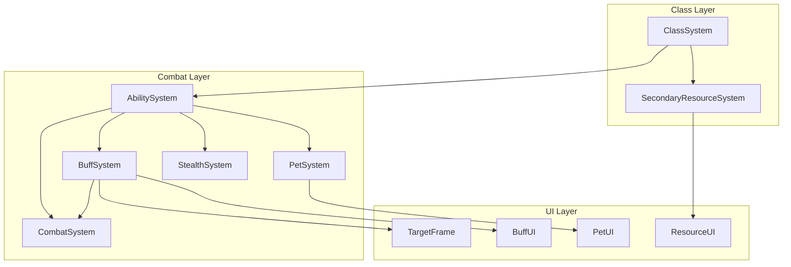

# Design Document: New Classes and Combat Systems

## Overview

Este diseño extiende el sistema de combate existente de EtherDomes para agregar 4 nuevas clases (Rogue, Hunter, Warlock, Death Knight) junto con los sistemas de soporte necesarios: buffs/debuffs, habilidades canalizadas, mascotas pasivas y sigilo.

El diseño se integra con los sistemas existentes:
- `AbilitySystem` - Se extiende para soportar channeled abilities
- `CombatSystem` - Se integra con el nuevo BuffSystem para DoTs/HoTs
- `ClassSystem` - Se extiende con las 4 nuevas clases
- `SecondaryResourceSystem` - Se extiende con Energy, Focus y Combo Points

## Architecture



## Components and Interfaces

### IBuffSystem

```csharp
public interface IBuffSystem
{
    // Core operations
    void ApplyBuff(ulong targetId, BuffData buff);
    void ApplyDebuff(ulong targetId, DebuffData debuff);
    void RemoveBuff(ulong targetId, string buffId);
    void RemoveDebuff(ulong targetId, string debuffId);
    void RemoveAllBuffs(ulong targetId);
    void RemoveAllDebuffs(ulong targetId);
    
    // Queries
    IReadOnlyList<BuffInstance> GetActiveBuffs(ulong targetId);
    IReadOnlyList<DebuffInstance> GetActiveDebuffs(ulong targetId);
    bool HasBuff(ulong targetId, string buffId);
    bool HasDebuff(ulong targetId, string debuffId);
    float GetRemainingDuration(ulong targetId, string effectId);
    
    // Events
    event Action<ulong, BuffInstance> OnBuffApplied;
    event Action<ulong, BuffInstance> OnBuffExpired;
    event Action<ulong, DebuffInstance> OnDebuffApplied;
    event Action<ulong, DebuffInstance> OnDebuffExpired;
    event Action<ulong, float, DamageType> OnDoTTick;
    event Action<ulong, float> OnHoTTick;
    
    // Constants
    int MaxBuffsPerEntity { get; } // 20
    int MaxDebuffsPerEntity { get; } // 20
    float MinDuration { get; } // 1 second
    float MaxDuration { get; } // 300 seconds
}
```

### IPetSystem

```csharp
public interface IPetSystem
{
    // Core operations
    void SummonPet(ulong ownerId, PetData petData);
    void DismissPet(ulong ownerId);
    void CommandAttack(ulong ownerId, ulong targetId);
    void CommandFollow(ulong ownerId);
    
    // Queries
    bool HasPet(ulong ownerId);
    PetInstance GetPet(ulong ownerId);
    float GetPetHealth(ulong ownerId);
    float GetPetMaxHealth(ulong ownerId);
    bool IsPetAlive(ulong ownerId);
    float GetResummonCooldown(ulong ownerId);
    
    // Events
    event Action<ulong, PetInstance> OnPetSummoned;
    event Action<ulong> OnPetDismissed;
    event Action<ulong> OnPetDied;
    event Action<ulong, ulong, float> OnPetDamageDealt;
    
    // Constants
    float FollowDistance { get; } // 3 meters
    float TeleportDistance { get; } // 40 meters
    float ResummonCooldown { get; } // 10 seconds
}
```

### IStealthSystem

```csharp
public interface IStealthSystem
{
    // Core operations
    bool TryEnterStealth(ulong playerId);
    void BreakStealth(ulong playerId, StealthBreakReason reason);
    
    // Queries
    bool IsInStealth(ulong playerId);
    float GetStealthCooldownRemaining(ulong playerId);
    bool CanEnterStealth(ulong playerId);
    bool CanUseStealthAbility(ulong playerId, string abilityId);
    
    // Events
    event Action<ulong> OnStealthEntered;
    event Action<ulong, StealthBreakReason> OnStealthBroken;
    
    // Constants
    float MovementSpeedMultiplier { get; } // 0.7 (70%)
    float StealthCooldown { get; } // 2 seconds
    float LocalPlayerOpacity { get; } // 0.3 (30%)
}

public enum StealthBreakReason
{
    Attack,
    DamageReceived,
    AbilityUsed,
    Manual
}
```

### Extended AbilityData for Channeled Abilities

```csharp
[Serializable]
public class AbilityData
{
    // Existing fields...
    
    // NEW: Channeled ability support
    public bool IsChanneled;
    public float ChannelDuration;
    public float TickInterval; // Default 1.0 second
    public int TotalTicks => IsChanneled ? Mathf.CeilToInt(ChannelDuration / TickInterval) : 0;
    
    // NEW: Stealth requirements
    public bool RequiresStealth;
    public bool BreaksStealth;
    
    // NEW: Combo point mechanics
    public bool GeneratesComboPoint;
    public bool ConsumesComboPoints;
    public float ComboPointDamageMultiplier; // Per combo point
    
    // NEW: Resource type override
    public ResourceType ResourceType; // Mana, Energy, Focus
    
    // NEW: Range constraints
    public float MinRange; // For Hunter dead zone
}
```

### New Enums

```csharp
public enum ResourceType
{
    None,
    Mana,
    Energy,
    Focus,
    Rage,
    HolyPower,
    ComboPoints
}

public enum EffectType
{
    Buff,
    Debuff,
    DoT,
    HoT,
    Slow,
    Stun,
    Fear,
    Root
}

public enum PetType
{
    Beast,      // Hunter
    Demon,      // Warlock
    Voidwalker, // Warlock tank
    Imp         // Warlock damage
}
```

## Data Models

### BuffData / DebuffData

```csharp
[Serializable]
public class BuffData
{
    public string BuffId;
    public string DisplayName;
    public Sprite Icon;
    public float Duration;
    public EffectType Type;
    
    // Stat modifications
    public CharacterStats StatModifiers;
    public float DamageMultiplier;
    public float HealingMultiplier;
    public float SpeedMultiplier;
    
    // DoT/HoT
    public bool IsPeriodicEffect;
    public float TickInterval;
    public float TickDamage;
    public float TickHealing;
    public DamageType DamageType;
}

[Serializable]
public class BuffInstance
{
    public BuffData Data;
    public float RemainingDuration;
    public float NextTickTime;
    public ulong SourceId; // Who applied it
    public DateTime AppliedTime;
}
```

### PetData

```csharp
[Serializable]
public class PetData
{
    public string PetId;
    public string DisplayName;
    public PetType Type;
    public float BaseHealth;
    public float BaseDamage;
    public float AttackSpeed;
    public float AttackRange;
    public AbilityData[] PetAbilities;
}

[Serializable]
public class PetInstance
{
    public PetData Data;
    public ulong OwnerId;
    public ulong PetEntityId;
    public float CurrentHealth;
    public ulong CurrentTargetId;
    public PetState State;
}

public enum PetState
{
    Following,
    Attacking,
    Dead,
    Dismissed
}
```

### Class Base Stats

```csharp
public static class ClassBaseStats
{
    public static CharacterStats GetBaseStats(CharacterClass characterClass)
    {
        return characterClass switch
        {
            CharacterClass.Rogue => new CharacterStats
            {
                MaxHealth = 90,
                Strength = 8,
                Agility = 15,
                Intellect = 5,
                Stamina = 10
            },
            CharacterClass.Hunter => new CharacterStats
            {
                MaxHealth = 95,
                Strength = 7,
                Agility = 14,
                Intellect = 6,
                Stamina = 11
            },
            CharacterClass.Warlock => new CharacterStats
            {
                MaxHealth = 85,
                Strength = 5,
                Agility = 6,
                Intellect = 15,
                Stamina = 9
            },
            CharacterClass.DeathKnight => new CharacterStats
            {
                MaxHealth = 110,
                Strength = 14,
                Agility = 6,
                Intellect = 8,
                Stamina = 14
            },
            _ => new CharacterStats()
        };
    }
    
    public static CharacterStats GetStatGrowthPerLevel(CharacterClass characterClass)
    {
        return characterClass switch
        {
            CharacterClass.Rogue => new CharacterStats { Agility = 2, Stamina = 1 },
            CharacterClass.Hunter => new CharacterStats { Agility = 2, Stamina = 1 },
            CharacterClass.Warlock => new CharacterStats { Intellect = 2, Stamina = 1 },
            CharacterClass.DeathKnight => new CharacterStats { Strength = 2, Stamina = 2 },
            _ => new CharacterStats()
        };
    }
}
```


## Correctness Properties

*A property is a characteristic or behavior that should hold true across all valid executions of a system—essentially, a formal statement about what the system should do. Properties serve as the bridge between human-readable specifications and machine-verifiable correctness guarantees.*

### Property 1: Buff Duration Bounds

*For any* buff or debuff applied to any entity, the duration SHALL be clamped between 1 and 300 seconds.

**Validates: Requirements 1.1**

### Property 2: Buff/Debuff Limit Enforcement

*For any* entity, the number of active buffs SHALL never exceed 20, and the number of active debuffs SHALL never exceed 20.

**Validates: Requirements 1.7, 1.8**

### Property 3: DoT/HoT Tick Consistency

*For any* DoT or HoT effect with duration D and tick interval T, the total number of ticks SHALL equal ceil(D / T), and each tick SHALL apply the configured damage/healing amount.

**Validates: Requirements 1.4, 1.5, 1.6**

### Property 4: Channeled Ability Tick Count

*For any* channeled ability with channel duration D and tick interval T, the number of effect applications SHALL equal ceil(D / T) if the channel completes without interruption.

**Validates: Requirements 2.1, 2.2, 2.3**

### Property 5: Channel Interruption on Movement

*For any* channeled ability in progress, if the caster moves more than 0.1 meters, the channel SHALL be interrupted and no further ticks SHALL occur.

**Validates: Requirements 2.4, 2.5**

### Property 6: Pet Follow Distance

*For any* pet in follow state, the distance between pet and owner SHALL converge to 3 meters (±0.5m tolerance).

**Validates: Requirements 3.3**

### Property 7: Pet Resummon Cooldown

*For any* pet that dies, attempting to resummon before 10 seconds have elapsed SHALL fail.

**Validates: Requirements 3.5**

### Property 8: Stealth Break Conditions

*For any* player in stealth, receiving damage OR executing an attack SHALL immediately break stealth.

**Validates: Requirements 4.2, 4.3**

### Property 9: Stealth Movement Speed

*For any* player in stealth, their effective movement speed SHALL be 70% of their base movement speed.

**Validates: Requirements 4.4**

### Property 10: Stealth Cooldown Enforcement

*For any* player whose stealth was broken, attempting to re-enter stealth within 2 seconds SHALL fail.

**Validates: Requirements 4.6**

### Property 11: Energy Regeneration Rate

*For any* Rogue, Energy SHALL regenerate at 10 per second, capped at 100 maximum.

**Validates: Requirements 5.2**

### Property 12: Combo Point Generation and Consumption

*For any* Rogue using a generator ability, combo points SHALL increase by 1 (max 5). *For any* Rogue using a finisher, all combo points SHALL be consumed and damage SHALL scale by (1 + comboPoints * multiplier).

**Validates: Requirements 5.3, 5.4, 5.5**

### Property 13: Focus Regeneration Rate

*For any* Hunter, Focus SHALL regenerate at 5 per second, capped at 100 maximum.

**Validates: Requirements 6.2**

### Property 14: Hunter Dead Zone Enforcement

*For any* Hunter ability with MinRange > 0, attempting to use it on a target within MinRange SHALL fail with "Too close" error.

**Validates: Requirements 6.8**

### Property 15: Drain Life Healing

*For any* Warlock using Drain Life, the healing received SHALL equal 50% of the damage dealt.

**Validates: Requirements 7.7**

### Property 16: Death Strike Healing

*For any* Death Knight using Death Strike, the healing received SHALL equal 25% of damage taken in the last 5 seconds (minimum 10% of max health).

**Validates: Requirements 8.8**

### Property 17: Diminishing Returns on CC

*For any* CC effect (stun, fear, slow) applied to a target, the effective duration SHALL be: 100% for 1st application, 50% for 2nd, 25% for 3rd. After 3 applications of the same CC type within 15 seconds, the target SHALL be immune for 15 seconds.

**Validates: Requirements 11.6, 11.7**

### Property 18: Class Stat Growth

*For any* character leveling up, their stats SHALL increase by the class-specific growth rates defined in ClassBaseStats.

**Validates: Requirements 12.6, 12.7**

## Error Handling

### BuffSystem Errors
- `BuffLimitReached`: When applying buff would exceed 20, oldest buff is replaced (not an error, but logged)
- `InvalidDuration`: Duration outside 1-300 range is clamped with warning
- `TargetNotFound`: Target entity doesn't exist, operation silently fails

### PetSystem Errors
- `PetAlreadyExists`: Summoning when pet exists dismisses old pet first
- `ResummonOnCooldown`: Returns false, UI shows cooldown remaining
- `InvalidPetData`: Null or invalid pet data, logs error and fails

### StealthSystem Errors
- `StealthOnCooldown`: Returns false, UI shows cooldown remaining
- `InCombat`: Cannot enter stealth while in combat (optional rule)
- `AlreadyInStealth`: No-op, returns true

### AbilitySystem Errors (Extended)
- `RequiresStealth`: Ability requires stealth but player not stealthed
- `TooClose`: Target within minimum range (Hunter dead zone)
- `InsufficientComboPoints`: Finisher requires at least 1 combo point

## Testing Strategy

### Unit Tests
- Test each system in isolation with mocked dependencies
- Test edge cases: 0 duration, max duration, exactly 20 buffs
- Test error conditions: invalid targets, cooldowns

### Property-Based Tests
- Use FsCheck for C# property-based testing
- Minimum 100 iterations per property
- Custom generators for BuffData, PetData, AbilityData

### Integration Tests
- Test BuffSystem + CombatSystem integration for DoT damage
- Test AbilitySystem + StealthSystem for stealth abilities
- Test ClassSystem + SecondaryResourceSystem for class resources

### Test Configuration
```csharp
// Property test base configuration
public abstract class NewClassesPropertyTestBase : PropertyTestBase
{
    protected static Arbitrary<BuffData> BuffDataArbitrary => 
        Arb.From(Gen.Elements(TestDataGenerators.GenerateBuffData()));
    
    protected static Arbitrary<PetData> PetDataArbitrary =>
        Arb.From(Gen.Elements(TestDataGenerators.GeneratePetData()));
}
```

