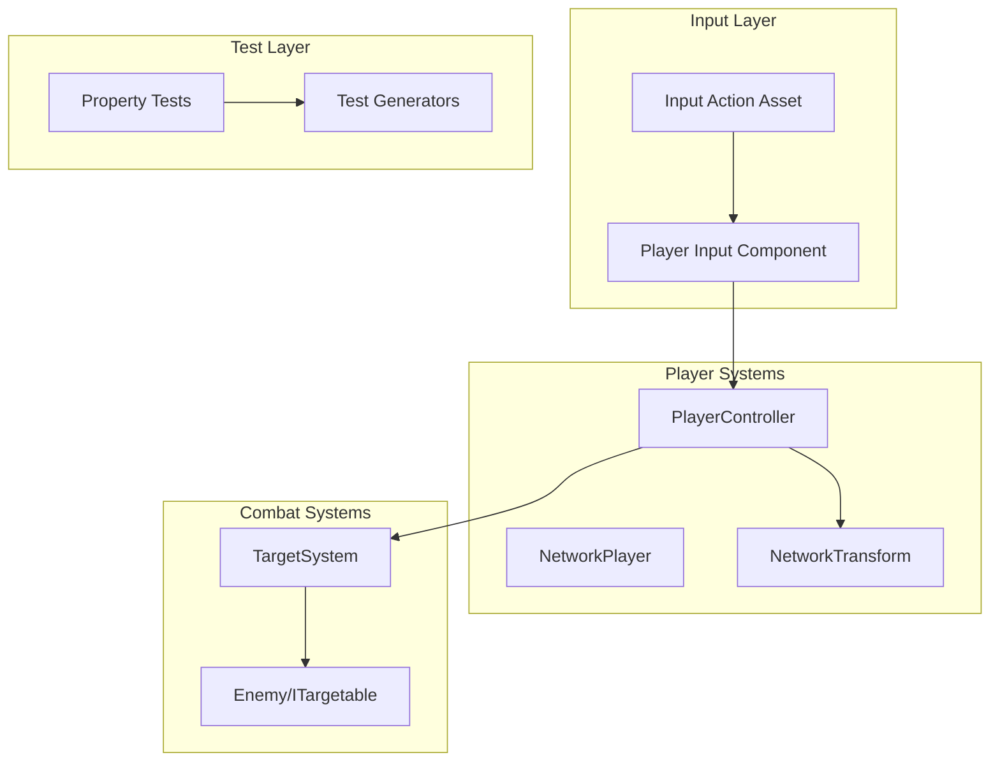

# Design Document: Gameplay Testing & Polish

## Overview

Este documento define la arquitectura técnica para las mejoras de gameplay testing:

- **Movimiento**: Verificar y mejorar el PlayerController existente
- **Enemigos**: Crear prefab de enemigo básico con ITargetable
- **Input System**: Migrar del Input Manager legacy al nuevo Unity Input System
- **Property Tests**: Implementar tests automatizados con NUnit

## Architecture



## Components and Interfaces

### Enemy Component

```csharp
public class Enemy : NetworkBehaviour, ITargetable
{
    [SerializeField] private string _displayName = "Enemy";
    [SerializeField] private float _maxHealth = 100f;
    
    private NetworkVariable<float> _currentHealth = new();
    private NetworkVariable<bool> _isAlive = new(true);
    
    // ITargetable implementation
    public uint NetworkId => NetworkObjectId;
    public string DisplayName => _displayName;
    public Vector3 Position => transform.position;
    public bool IsAlive => _isAlive.Value;
    public TargetType Type => TargetType.Enemy;
    public int Level => 1;
    public Transform Transform => transform;
    
    public void TakeDamage(float damage);
    public void Die();
}
```

### Input Action Asset Structure

```
EtherDomesInput.inputactions
├── Player (Action Map)
│   ├── Move (Value, Vector2) - WASD/Left Stick
│   ├── Look (Value, Vector2) - Mouse/Right Stick
│   ├── Tab (Button) - Tab key
│   ├── Escape (Button) - Escape key
│   ├── Ability1-9 (Buttons) - Number keys 1-9
│   └── Jump (Button) - Space
└── UI (Action Map)
    ├── Navigate (Value, Vector2)
    ├── Submit (Button)
    └── Cancel (Button)
```

### Updated PlayerController

```csharp
public class PlayerController : NetworkBehaviour
{
    [SerializeField] private float _moveSpeed = 5f;
    [SerializeField] private InputActionReference _moveAction;
    
    private CharacterController _characterController;
    private Vector2 _moveInput;
    
    public override void OnNetworkSpawn()
    {
        if (!IsOwner) return;
        EnableInput();
    }
    
    private void EnableInput()
    {
        _moveAction.action.Enable();
        _moveAction.action.performed += OnMove;
        _moveAction.action.canceled += OnMove;
    }
    
    private void OnMove(InputAction.CallbackContext ctx)
    {
        _moveInput = ctx.ReadValue<Vector2>();
    }
    
    private void Update()
    {
        if (!IsOwner) return;
        ProcessMovement();
    }
    
    private void ProcessMovement()
    {
        var camera = Camera.main;
        var forward = camera.transform.forward;
        var right = camera.transform.right;
        forward.y = 0; right.y = 0;
        forward.Normalize(); right.Normalize();
        
        var moveDir = forward * _moveInput.y + right * _moveInput.x;
        _characterController.Move(moveDir * _moveSpeed * Time.deltaTime);
    }
}
```

## Data Models

### Enemy Prefab Structure

```
Enemy (Prefab)
├── NetworkObject
├── Enemy.cs (ITargetable)
├── CapsuleCollider
├── MeshRenderer (Red material)
├── TargetIndicator (child)
│   └── Projector/Circle mesh (hidden by default)
└── HealthBar (child, optional)
```

## Correctness Properties

*A property is a characteristic or behavior that should hold true across all valid executions of a system.*


### Property 1: Movement Direction Relative to Camera
*For any* camera orientation and any movement input (W/A/S/D or combinations), the resulting movement direction SHALL be relative to the camera's horizontal forward/right vectors.
**Validates: Requirements 1.1, 1.2, 1.3, 1.4, 1.5**

### Property 2: Ownership-Based Input Blocking
*For any* PlayerController where IsOwner is false, any movement input SHALL result in zero position change.
**Validates: Requirements 1.6**

### Property 3: Target Range Inclusion
*For any* enemy at distance D from the player, the enemy SHALL be included in Tab cycling if and only if D < 40 meters.
**Validates: Requirements 2.5**

### Property 4: Dead Target Removal
*For any* enemy that transitions from IsAlive=true to IsAlive=false, the enemy SHALL be removed from the TargetSystem's valid targets list.
**Validates: Requirements 2.6**

### Property 5: Input Binding Persistence Round-Trip
*For any* valid input binding override, saving and then loading the bindings SHALL produce equivalent binding data.
**Validates: Requirements 3.5**

## Error Handling

| Error Scenario | Handling Strategy |
|----------------|-------------------|
| No camera found | Use world forward (0,0,1) as fallback |
| CharacterController missing | Log error, disable movement |
| Input Action not bound | Log warning, action does nothing |
| Enemy prefab missing components | Validation in OnValidate() |

## Testing Strategy

### Unit Tests
- PlayerController movement calculations (mock input)
- Enemy ITargetable implementation
- TargetSystem range calculations
- Input binding serialization

### Property-Based Tests
Using NUnit with custom generators:

1. **Movement Direction Property** - Generate random camera rotations, verify movement direction
2. **Ownership Blocking Property** - Generate inputs with IsOwner=false, verify no movement
3. **Target Range Property** - Generate random enemy positions, verify inclusion/exclusion
4. **Dead Target Property** - Generate enemy death events, verify removal
5. **Binding Persistence Property** - Generate random binding overrides, verify round-trip

### Integration Tests
- Full player spawn and movement in networked session
- Tab-target cycling with multiple enemies
- Input rebinding UI flow

## Project Structure Additions

```
TheEtherDomes/
├── Assets/
│   ├── _Project/
│   │   ├── Scripts/
│   │   │   ├── Enemy/
│   │   │   │   └── Enemy.cs
│   │   │   └── Input/
│   │   │       └── InputManager.cs
│   │   ├── Input/
│   │   │   └── EtherDomesInput.inputactions
│   │   └── Prefabs/
│   │       └── Enemies/
│   │           └── BasicEnemy.prefab
│   └── Tests/
│       ├── EditMode/
│       │   ├── MovementTests.cs
│       │   ├── TargetSystemTests.cs
│       │   └── PropertyTests/
│       │       ├── MovementPropertyTests.cs
│       │       └── TargetPropertyTests.cs
│       └── PlayMode/
│           └── IntegrationTests.cs
```
