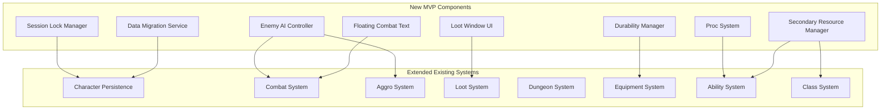

# Design Document: MVP 10 Features

## Overview

Este documento define el diseño técnico para las 10 features del MVP de The Ether Domes, basado en los requisitos aprobados. El diseño extiende la arquitectura existente con nuevos componentes para:

- **Session Locking**: Prevención de uso simultáneo de personajes
- **Data Migration**: Versionado y migración automática de datos
- **Enemy AI**: Máquina de estados con aggro dinámico y leashing
- **Need/Greed Loot**: Sistema de distribución con Bad Luck Protection
- **Dungeon Difficulties**: Tres niveles con mecánicas exclusivas
- **Combat Feedback**: Floating Combat Text y indicadores de aggro
- **Soft Caps**: Diminishing returns para stats secundarios
- **Durability**: Degradación de equipo con penalización de stats
- **Procs & Resources**: Sistema de procs y recursos secundarios (Rage, Holy Power)
- **Friendly Fire**: AoE que afecta aliados y enemigos

## Architecture



## Components and Interfaces

### Session Lock Manager

```csharp
public interface ISessionLockManager
{
    bool TryAcquireLock(string characterId);
    void ReleaseLock(string characterId);
    bool IsLocked(string characterId);
    void CleanupStaleLocks(TimeSpan maxAge);
    
    event Action<string> OnLockAcquired;
    event Action<string> OnLockReleased;
    event Action<string> OnLockDenied;
    
    TimeSpan StaleLockThreshold { get; } // 5 minutes
}
```

### Data Migration Service

```csharp
public interface IDataMigrationService
{
    int CurrentVersion { get; }
    CharacterData Migrate(CharacterData oldData);
    bool NeedsMigration(CharacterData data);
    
    void RegisterMigration(int fromVersion, int toVersion, Func<CharacterData, CharacterData> migrator);
}

// Extended CharacterData
[Serializable]
public class CharacterData
{
    // Existing fields...
    public int DataVersion; // NEW: Version tag for migration
}
```

### Enemy AI Controller

```csharp
public interface IEnemyAI
{
    void Initialize(ulong enemyId, Vector3 spawnPosition);
    void SetState(EnemyAIState state);
    EnemyAIState CurrentState { get; }
    
    ulong CurrentTargetId { get; }
    Vector3 SpawnPosition { get; }
    float DistanceFromSpawn { get; }
    
    event Action<EnemyAIState> OnStateChanged;
    event Action<ulong> OnTargetChanged;
}

public enum EnemyAIState
{
    Idle,
    Patrol,
    Aggro,
    Combat,
    Returning,
    Dead
}

public class EnemyAIConfig
{
    public float AggroRange = 15f;
    public float LeashDistance = 40f;
    public float AttackRange = 2f;
    public float AttackCooldown = 2f;
    public float ReturnSpeed = 1.5f;
    public bool AlertNearbyEnemies = true;
    public float AlertRadius = 15f;
}
```

### Loot Distribution System

```csharp
public interface ILootDistributionSystem
{
    void StartNeedGreedRoll(LootDrop[] items, ulong[] eligiblePlayers);
    void SubmitRoll(ulong playerId, string itemId, LootRollType rollType);
    void FinalizeRolls(string itemId);
    
    float GetBadLuckProtectionBonus(ulong playerId, ItemRarity rarity);
    void RecordLootAttempt(ulong playerId, ItemRarity rarity, bool success);
    
    event Action<ulong, ItemData> OnItemAwarded;
    event Action<string, LootRollResult[]> OnRollsFinalized;
    
    int BadLuckProtectionThreshold { get; } // 10 attempts
    float BadLuckProtectionBonusPerAttempt { get; } // 5%
}

public enum LootRollType
{
    Need,
    Greed,
    Pass
}

public struct LootRollResult
{
    public ulong PlayerId;
    public LootRollType RollType;
    public int RollValue; // 1-100
}
```

### Salvage System

```csharp
public interface ISalvageSystem
{
    SalvageResult Salvage(ItemData item);
    SalvagePreview PreviewSalvage(ItemData item);
    
    event Action<ItemData, SalvageResult> OnItemSalvaged;
}

public struct SalvageResult
{
    public MaterialData[] Materials;
    public int TotalValue;
}

public struct MaterialData
{
    public string MaterialId;
    public string MaterialName;
    public int Quantity;
    public ItemRarity Rarity;
}
```

### Dungeon Difficulty System

```csharp
public interface IDungeonDifficultySystem
{
    DungeonDifficulty CurrentDifficulty { get; }
    void SetDifficulty(string instanceId, DungeonDifficulty difficulty);
    
    DifficultyModifiers GetModifiers(DungeonDifficulty difficulty);
    string[] GetExclusiveLoot(DungeonDifficulty difficulty);
    MechanicData[] GetAdditionalMechanics(DungeonDifficulty difficulty);
}

public enum DungeonDifficulty
{
    Normal,
    Heroic,
    Mythic
}

public struct DifficultyModifiers
{
    public float HealthMultiplier;    // 1.0, 1.5, 2.0
    public float DamageMultiplier;    // 1.0, 1.3, 1.6
    public float LootQualityBonus;    // 0, 0.1, 0.2
    public int AdditionalMechanics;   // 0, 1, 2
}
```

### Wipe Tracking System

```csharp
public interface IWipeTracker
{
    int GetWipeCount(string instanceId);
    void RecordWipe(string instanceId);
    void ResetWipeCount(string instanceId);
    bool ShouldExpelGroup(string instanceId);
    
    event Action<string, int> OnWipeRecorded;
    event Action<string> OnGroupExpelled;
    
    int MaxWipesBeforeExpulsion { get; } // 3
}
```

### Floating Combat Text System

```csharp
public interface IFloatingCombatText
{
    void ShowDamage(Vector3 position, float amount, DamageType type, bool isCrit);
    void ShowHealing(Vector3 position, float amount, bool isCrit);
    void ShowMiss(Vector3 position);
    void ShowStatus(Vector3 position, string text, Color color);
    
    FCTConfig Config { get; set; }
}

public class FCTConfig
{
    public Color NormalDamageColor = Color.white;
    public Color CritDamageColor = Color.yellow;
    public Color HealingColor = Color.green;
    public Color DamageTakenColor = Color.red;
    public float FloatSpeed = 1f;
    public float FadeTime = 1.5f;
    public float CritScale = 1.5f;
}
```

### Aggro Indicator System

```csharp
public interface IAggroIndicator
{
    void ShowAggroIcon(ulong playerId, bool hasAggro);
    void UpdatePartyFrameColor(ulong playerId, AggroLevel level);
    void DrawAggroLine(ulong enemyId, ulong targetPlayerId);
    void ClearAllIndicators();
    
    event Action<ulong, AggroLevel> OnAggroLevelChanged;
}

public enum AggroLevel
{
    None,
    Low,      // <50% of highest
    Medium,   // 50-90% of highest
    High,     // >90% of highest
    HasAggro  // Current target
}
```

### Soft Cap System

```csharp
public interface ISoftCapSystem
{
    float ApplyDiminishingReturns(StatType stat, float rawValue);
    float GetEffectiveValue(StatType stat, float rawValue);
    SoftCapInfo GetSoftCapInfo(StatType stat);
}

public struct SoftCapInfo
{
    public float FirstThreshold;      // 30%
    public float FirstPenalty;        // 50% DR
    public float SecondThreshold;     // 50%
    public float SecondPenalty;       // 75% DR
    public float HardCap;             // 75% max
}

public enum StatType
{
    CritChance,
    Haste,
    Mastery,
    Versatility,
    Armor
}
```

### Durability System

```csharp
public interface IDurabilitySystem
{
    void DegradeDurability(ulong playerId, float amount);
    void RepairItem(ulong playerId, EquipmentSlot slot);
    void RepairAllItems(ulong playerId);
    
    float GetDurability(ulong playerId, EquipmentSlot slot);
    float GetDurabilityPercent(ulong playerId, EquipmentSlot slot);
    bool IsItemBroken(ulong playerId, EquipmentSlot slot);
    float GetStatPenalty(ulong playerId, EquipmentSlot slot);
    
    event Action<ulong, EquipmentSlot, float> OnDurabilityChanged;
    event Action<ulong, EquipmentSlot> OnItemBroken;
    
    float BrokenItemStatPenalty { get; } // 0.5 (50% stats)
}

// Extended ItemData
[Serializable]
public class ItemData
{
    // Existing fields...
    public float MaxDurability;
    public float CurrentDurability;
}
```

### Proc System

```csharp
public interface IProcSystem
{
    void RegisterProc(string abilityId, ProcData proc);
    void CheckProcs(ulong playerId, string triggerAbilityId, ProcTrigger trigger);
    
    event Action<ulong, ProcData> OnProcTriggered;
}

public class ProcData
{
    public string ProcId;
    public string ProcName;
    public float Chance;           // 0-1
    public ProcTrigger Trigger;
    public ProcEffect Effect;
    public float EffectValue;
    public float Duration;
    public float InternalCooldown;
}

public enum ProcTrigger
{
    OnAbilityUse,
    OnDamageDealt,
    OnHealingDone,
    OnDamageTaken,
    OnCrit
}

public enum ProcEffect
{
    ResetCooldown,
    ReduceCooldown,
    IncreaseDamage,
    IncreaseHealing,
    RestoreResource,
    ApplyBuff
}
```

### Secondary Resource System

```csharp
public interface ISecondaryResourceSystem
{
    void RegisterResource(ulong playerId, SecondaryResourceType type);
    void AddResource(ulong playerId, float amount);
    void SpendResource(ulong playerId, float amount);
    float GetResource(ulong playerId);
    float GetMaxResource(ulong playerId);
    SecondaryResourceType GetResourceType(ulong playerId);
    
    event Action<ulong, float> OnResourceChanged;
    event Action<ulong> OnResourceFull;
    event Action<ulong> OnResourceEmpty;
}

public enum SecondaryResourceType
{
    None,       // Mage, Priest (MVP)
    Rage,       // Warrior
    HolyPower   // Paladin
}

public class ResourceConfig
{
    public SecondaryResourceType Type;
    public float MaxValue;
    public float DecayRate;         // Per second out of combat
    public float GenerationRate;    // Base generation
    public bool GenerateOnDamageDealt;
    public bool GenerateOnDamageTaken;
}
```

### Friendly Fire System

```csharp
public interface IFriendlyFireSystem
{
    bool IsFriendlyFireEnabled { get; }
    void ApplyAoEDamage(Vector3 center, float radius, float damage, ulong sourceId, bool affectAllies);
    void ApplyAoEHealing(Vector3 center, float radius, float healing, ulong sourceId, bool affectEnemies);
    
    List<ulong> GetAffectedTargets(Vector3 center, float radius, TargetFilter filter);
}

public enum TargetFilter
{
    AlliesOnly,
    EnemiesOnly,
    All
}
```

### Weekly Lockout System

```csharp
public interface IWeeklyLockoutSystem
{
    bool IsLockedOut(ulong playerId, string bossId);
    void RecordKill(ulong playerId, string bossId);
    DateTime GetResetTime();
    List<string> GetLockedBosses(ulong playerId);
    
    event Action OnWeeklyReset;
}
```

---

## Blind Spot Components

*Componentes identificados como puntos ciegos que requieren implementación para soportar los sistemas principales.*

### Mana System

```csharp
public interface IManaSystem
{
    float GetCurrentMana(ulong playerId);
    float GetMaxMana(ulong playerId);
    float GetManaPercent(ulong playerId);
    
    bool TrySpendMana(ulong playerId, float amount);
    void RestoreMana(ulong playerId, float amount);
    void SetMaxMana(ulong playerId, float maxMana);
    
    void StartCombatRegen(ulong playerId);
    void StartOutOfCombatRegen(ulong playerId);
    
    event Action<ulong, float, float> OnManaChanged; // playerId, current, max
    event Action<ulong> OnManaEmpty;
    
    float OutOfCombatRegenRate { get; } // 2% per second
    float InCombatRegenRate { get; }    // 0.5% per second
}
```

### Party System

```csharp
public interface IPartySystem
{
    bool IsInParty(ulong playerId);
    ulong[] GetPartyMembers(ulong playerId);
    ulong GetPartyLeader(ulong playerId);
    int GetPartySize(ulong playerId);
    
    bool TryInvitePlayer(ulong inviterId, ulong inviteeId);
    void AcceptInvite(ulong playerId, ulong partyLeaderId);
    void DeclineInvite(ulong playerId, ulong partyLeaderId);
    void LeaveParty(ulong playerId);
    void KickPlayer(ulong leaderId, ulong targetId);
    void PromoteToLeader(ulong currentLeaderId, ulong newLeaderId);
    
    event Action<ulong, ulong> OnPlayerInvited;      // inviter, invitee
    event Action<ulong, ulong> OnPlayerJoined;       // party, player
    event Action<ulong, ulong> OnPlayerLeft;         // party, player
    event Action<ulong, ulong> OnLeaderChanged;      // party, newLeader
    event Action<ulong> OnPartyDisbanded;
    
    int MaxPartySize { get; } // 10
}

public struct PartyInvite
{
    public ulong InviterId;
    public ulong InviteeId;
    public DateTime ExpiresAt;
}
```

### Latency Monitor

```csharp
public interface ILatencyMonitor
{
    float CurrentLatency { get; }
    float AverageLatency { get; }
    LatencyState CurrentState { get; }
    
    bool IsHighLatency { get; }
    bool IsPaused { get; }
    
    event Action<LatencyState> OnLatencyStateChanged;
    event Action OnActionsPaused;
    event Action OnActionsResumed;
    
    float WarningThreshold { get; }  // 200ms
    float PauseThreshold { get; }    // 500ms
    float ResumeThreshold { get; }   // 400ms
}

public enum LatencyState
{
    Normal,     // <200ms
    Warning,    // 200-500ms
    Paused      // >500ms
}
```

### Enemy Damage Tracking

```csharp
// Extension to Enemy.cs
public interface IEnemyDamageTracker
{
    void RecordDamage(ulong playerId, float damage);
    float GetTotalDamage(ulong playerId);
    ulong GetHighestDamageDealer();
    void ClearDamageTracking();
    
    IReadOnlyDictionary<ulong, float> DamageByPlayer { get; }
}
```

### Loot Window UI

```csharp
public interface ILootWindowUI
{
    void Show(LootDrop[] items, float timeoutSeconds);
    void Hide();
    void UpdateRollStatus(string itemId, LootRollResult[] results);
    void ShowWinner(string itemId, ulong winnerId, string winnerName);
    
    event Action<string, LootRollType> OnRollSubmitted; // itemId, rollType
    
    bool IsVisible { get; }
    float TimeRemaining { get; }
}

public struct LootDrop
{
    public string ItemId;
    public ItemData Item;
    public ulong SourceEnemyId;
}
```

### Inventory UI

```csharp
public interface IInventoryUI
{
    void Show();
    void Hide();
    void Toggle();
    void RefreshSlots();
    void SetSlot(int index, ItemData item);
    void ClearSlot(int index);
    void UpdateCurrency(int gold);
    
    event Action<int> OnSlotClicked;           // slotIndex
    event Action<int> OnSlotRightClicked;      // slotIndex
    event Action<int, int> OnSlotDragged;      // fromIndex, toIndex
    
    bool IsVisible { get; }
    int SlotCount { get; } // 30
}
```

### Character Select UI

```csharp
public interface ICharacterSelectUI
{
    void Show();
    void Hide();
    void RefreshCharacterList(CharacterSummary[] characters);
    void ShowCreationPanel();
    void HideCreationPanel();
    void SetSelectedCharacter(int index);
    
    event Action<int> OnCharacterSelected;     // index
    event Action<int> OnPlayClicked;           // index
    event Action<int> OnDeleteClicked;         // index
    event Action OnNewCharacterClicked;
    event Action<CharacterCreationData> OnCharacterCreated;
    
    bool IsVisible { get; }
}

public struct CharacterSummary
{
    public string CharacterId;
    public string CharacterName;
    public CharacterClass Class;
    public int Level;
}

public struct CharacterCreationData
{
    public string CharacterName;
    public CharacterClass Class;
    public Specialization InitialSpec;
}
```

### Repair UI

```csharp
public interface IRepairUI
{
    void Show();
    void Hide();
    void RefreshEquipment(EquipmentDurabilityInfo[] equipment);
    void UpdatePlayerGold(int gold);
    
    event Action<EquipmentSlot> OnRepairClicked;
    event Action OnRepairAllClicked;
    
    bool IsVisible { get; }
}

public struct EquipmentDurabilityInfo
{
    public EquipmentSlot Slot;
    public ItemData Item;
    public float CurrentDurability;
    public float MaxDurability;
    public int RepairCost;
}
```

---

## Data Models

### Extended Character Data

```csharp
[Serializable]
public class CharacterData
{
    // Existing fields
    public string CharacterId;
    public string CharacterName;
    public CharacterClass Class;
    public Specialization CurrentSpec;
    public int Level;
    public int Experience;
    public CharacterStats BaseStats;
    public EquipmentData Equipment;
    public string[] UnlockedAbilityIds;
    public DateTime LastSaveTime;
    public byte[] IntegrityHash;
    
    // NEW: Version for migration
    public int DataVersion;
    
    // NEW: Mana system
    public float CurrentMana;
    public float MaxMana;
    
    // NEW: Secondary resource state
    public float SecondaryResource;
    public SecondaryResourceType ResourceType;
    
    // NEW: Bad luck protection tracking
    public Dictionary<ItemRarity, int> LootAttempts;
    
    // NEW: Weekly lockout data
    public List<string> LockedBossIds;
    public DateTime LockoutResetTime;
    
    // NEW: Inventory (separate from Equipment)
    public List<ItemData> Inventory;
}
```

### Boss Data with Mechanics

```csharp
[Serializable]
public class BossData
{
    public string BossId;
    public string BossName;
    public float BaseHealth;
    public float BaseDamage;
    
    // Mechanics per difficulty
    public MechanicData[] NormalMechanics;
    public MechanicData[] HeroicMechanics;
    public MechanicData[] MythicMechanics;
    
    // Loot tables per difficulty
    public LootTable NormalLoot;
    public LootTable HeroicLoot;
    public LootTable MythicLoot;
    
    // Scaling
    public float HealthPerPlayer = 0.2f; // 20% per player
}

[Serializable]
public class MechanicData
{
    public string MechanicId;
    public string MechanicName;
    public MechanicType Type;
    public float TellDuration;      // Time before execution
    public float Damage;
    public float Radius;
    public float Cooldown;
    public string VisualIndicator;  // Prefab name
}

public enum MechanicType
{
    GroundAoE,
    Cleave,
    Enrage,
    AddSpawn,
    PhaseTransition
}
```

## Correctness Properties

*A property is a characteristic or behavior that should hold true across all valid executions of a system—essentially, a formal statement about what the system should do. Properties serve as the bridge between human-readable specifications and machine-verifiable correctness guarantees.*

### Session Locking Properties

**Property 1: Session Lock Mutual Exclusion**
*For any* character ID, if TryAcquireLock returns true, subsequent calls to TryAcquireLock with the same ID SHALL return false until ReleaseLock is called.
**Validates: Requirements 1.1, 1.2**

**Property 2: Stale Lock Cleanup**
*For any* lock older than StaleLockThreshold (5 minutes), CleanupStaleLocks SHALL remove it and allow new acquisition.
**Validates: Requirements 1.4**

### Data Migration Properties

**Property 3: Version Tag Persistence**
*For any* saved CharacterData, the DataVersion field SHALL be set to CurrentVersion at save time.
**Validates: Requirements 1.5**

**Property 4: Migration Idempotence**
*For any* CharacterData at CurrentVersion, calling Migrate SHALL return an equivalent object (no changes).
**Validates: Requirements 1.6**

**Property 5: Migration Preserves Identity**
*For any* CharacterData before and after migration, CharacterId, CharacterName, Level, and Experience SHALL remain unchanged.
**Validates: Requirements 1.7**

### Class System Properties

**Property 6: Spec Change Replaces Abilities**
*For any* Hybrid_Class changing specialization, the intersection of abilities before and after SHALL be empty (complete replacement).
**Validates: Requirements 2.1**

**Property 7: Ability Count Per Spec**
*For any* class and specialization combination, GetClassAbilities SHALL return between 4 and 5 abilities.
**Validates: Requirements 2.2**

### Enemy AI Properties

**Property 8: Target Selection on Death**
*For any* enemy whose current target dies, the new target SHALL be the player with highest total damage dealt to that enemy.
**Validates: Requirements 3.1**

**Property 9: Alert Radius Propagation**
*For any* enemy entering combat, all enemies within AlertRadius (15m) SHALL also enter combat.
**Validates: Requirements 3.2**

**Property 10: Leash Distance Enforcement**
*For any* enemy at distance > LeashDistance (40m) from spawn, CurrentState SHALL transition to Returning.
**Validates: Requirements 3.3**

**Property 11: HP Preservation on Return**
*For any* enemy transitioning to Returning state, HP before and after return SHALL be equal.
**Validates: Requirements 3.4**

### Loot System Properties

**Property 12: Bad Luck Protection Activation**
*For any* player with 10+ failed attempts at a rarity, GetBadLuckProtectionBonus SHALL return > 0.
**Validates: Requirements 4.4**

**Property 13: Bad Luck Protection Scaling**
*For any* player with N failed attempts (N > 10), bonus SHALL equal (N - 10) * 0.05.
**Validates: Requirements 4.5**

**Property 14: Salvage Produces Materials**
*For any* item with Rarity > Common, Salvage SHALL return at least one MaterialData.
**Validates: Requirements 4.7, 4.8**

### Dungeon Properties

**Property 15: Difficulty Stat Scaling**
*For any* difficulty D2 > D1, GetModifiers(D2).HealthMultiplier > GetModifiers(D1).HealthMultiplier.
**Validates: Requirements 5.2**

**Property 16: Wipe Respawn Location**
*For any* wipe event, all players SHALL respawn at dungeon entrance position.
**Validates: Requirements 5.4**

**Property 17: Three Wipe Expulsion**
*For any* instance with WipeCount >= 3, ShouldExpelGroup SHALL return true.
**Validates: Requirements 5.5**

**Property 18: Weekly Lockout Enforcement**
*For any* player who has killed a boss this week, IsLockedOut SHALL return true for that boss.
**Validates: Requirements 5.7**

### Combat Feedback Properties

**Property 19: FCT on Damage**
*For any* ApplyDamage call with damage > 0, ShowDamage SHALL be called with matching amount.
**Validates: Requirements 6.3**

**Property 20: FCT Color Differentiation**
*For any* crit damage, FCT color SHALL equal CritDamageColor (yellow), not NormalDamageColor.
**Validates: Requirements 6.4**

### Soft Cap Properties

**Property 21: Diminishing Returns Formula**
*For any* stat value V > FirstThreshold (30%), effective value SHALL be less than V.
**Validates: Requirements 8.2, 8.3**

**Property 22: Hard Cap Enforcement**
*For any* stat value, GetEffectiveValue SHALL never exceed HardCap (75%).
**Validates: Requirements 8.2**

### Durability Properties

**Property 23: Durability Degradation**
*For any* combat action, DegradeDurability SHALL reduce CurrentDurability by a positive amount.
**Validates: Requirements 8.5**

**Property 24: Broken Item Stat Penalty**
*For any* item with CurrentDurability = 0, GetStatPenalty SHALL return BrokenItemStatPenalty (0.5).
**Validates: Requirements 8.6**

### Proc System Properties

**Property 25: Proc Probability**
*For any* proc with Chance C, over large sample, trigger rate SHALL approximate C.
**Validates: Requirements 9.1**

### Resource System Properties

**Property 26: Class Resource Assignment**
*For any* Warrior, GetResourceType SHALL return Rage. For any Paladin, SHALL return HolyPower.
**Validates: Requirements 9.3**

### Friendly Fire Properties

**Property 27: AoE Affects All Targets**
*For any* AoE with affectAllies=true, GetAffectedTargets SHALL include both allies and enemies in radius.
**Validates: Requirements 9.4, 9.5**

### Interrupt Properties

**Property 28: Interrupt Cancels Cast**
*For any* interrupt hitting during enemy cast, enemy IsCasting SHALL become false immediately.
**Validates: Requirements 9.7**

**Property 29: Interrupt Lockout Duration**
*For any* successful interrupt, enemy SHALL be unable to cast for 4 seconds.
**Validates: Requirements 9.7**

### Boss Scaling Properties

**Property 30: HP Scaling Per Player**
*For any* boss with N players, effective HP SHALL equal BaseHealth * (1 + (N-1) * HealthPerPlayer).
**Validates: Requirements 10.7**

---

## Blind Spot Properties

### Mana System Properties

**Property 31: Mana Cost Enforcement**
*For any* ability with ManaCost > CurrentMana, TrySpendMana SHALL return false and ability SHALL NOT execute.
**Validates: Requirements 12.3**

**Property 32: Mana Regeneration Rates**
*For any* player out of combat, mana regeneration rate SHALL equal 2% of MaxMana per second.
*For any* player in combat, mana regeneration rate SHALL equal 0.5% of MaxMana per second.
**Validates: Requirements 12.4, 12.5**

### Party System Properties

**Property 33: Party Size Limits**
*For any* party, GetPartySize SHALL return value between 2 and MaxPartySize (10).
**Validates: Requirements 14.1**

**Property 34: Party Leader Succession**
*For any* party where leader disconnects, GetPartyLeader SHALL return a different connected member.
**Validates: Requirements 14.5**

### Latency Monitor Properties

**Property 35: Latency State Transitions**
*For any* latency > PauseThreshold (500ms), CurrentState SHALL be Paused.
*For any* latency < ResumeThreshold (400ms) after being Paused, CurrentState SHALL transition to Normal or Warning.
**Validates: Requirements 21.3, 21.4**

**Property 36: Action Pause Enforcement**
*For any* player in Paused state, ability execution, movement commands, and loot interactions SHALL be blocked.
**Validates: Requirements 21.5**

### Enemy Damage Tracking Properties

**Property 37: Damage Accumulation**
*For any* damage applied to enemy, GetTotalDamage for that player SHALL increase by exactly that amount.
**Validates: Requirements 13.2**

**Property 38: Highest Damage Dealer Selection**
*For any* enemy with damage tracking, GetHighestDamageDealer SHALL return the playerId with maximum total damage.
**Validates: Requirements 13.3**

### UI Properties

**Property 39: Loot Window Timeout**
*For any* loot window shown with timeout T, after T seconds without response, auto-pass SHALL be submitted.
**Validates: Requirements 15.4**

**Property 40: Inventory Slot Count**
*For any* inventory UI, SlotCount SHALL equal 30.
**Validates: Requirements 16.1**

## Error Handling

### Session Lock Errors

| Error Scenario | Handling Strategy |
|----------------|-------------------|
| Lock file corrupted | Delete and allow new lock |
| Lock owned by crashed process | Check timestamp, cleanup if stale |
| Disk full | Log error, deny lock |

### Migration Errors

| Error Scenario | Handling Strategy |
|----------------|-------------------|
| Unknown version | Create backup, attempt best-effort migration |
| Migration fails | Restore from backup, notify player |
| Data corruption detected | Reject load, offer character reset |

### Loot Errors

| Error Scenario | Handling Strategy |
|----------------|-------------------|
| Roll timeout | Auto-pass for non-responders |
| Inventory full | Mail item to player |
| Network disconnect during roll | Preserve roll state, resume on reconnect |

### Dungeon Errors

| Error Scenario | Handling Strategy |
|----------------|-------------------|
| Instance creation fails | Notify group, retry once |
| Boss state desync | Force state from server |
| Wipe during phase transition | Reset to phase start |

## Testing Strategy

### Unit Tests

1. **Session Lock Tests**
   - Lock acquisition and release
   - Stale lock detection
   - Concurrent lock attempts

2. **Migration Tests**
   - Version tag storage
   - Migration chain execution
   - Data preservation

3. **Enemy AI Tests**
   - State transitions
   - Target selection logic
   - Leash behavior

4. **Loot Tests**
   - Need/Greed resolution
   - Bad luck protection calculation
   - Salvage material generation

5. **Dungeon Tests**
   - Difficulty modifier application
   - Wipe counting
   - Weekly lockout tracking

6. **Combat Feedback Tests**
   - FCT creation on events
   - Color selection logic

7. **Soft Cap Tests**
   - Diminishing returns formula
   - Hard cap enforcement

8. **Durability Tests**
   - Degradation calculation
   - Stat penalty application

9. **Proc Tests**
   - Trigger probability
   - Effect application

10. **Resource Tests**
    - Generation and spending
    - Class-specific assignment

### Property-Based Tests

**Configuration:**
- Library: FsCheck for C#/.NET
- Minimum 100 iterations per test
- Tag format: `// Feature: mvp-10-features, Property N: [title]`

**Key Properties to Test:**
- P1: Session Lock Mutual Exclusion
- P4: Migration Idempotence
- P6: Spec Change Replaces Abilities
- P12-13: Bad Luck Protection
- P21-22: Soft Cap Diminishing Returns
- P24: Broken Item Stat Penalty
- P27: AoE Friendly Fire
- P30: Boss HP Scaling

### Integration Tests

1. **Full Session Lock Flow** - Acquire, use, release, cleanup
2. **Migration Chain** - v1 → v2 → v3 data migration
3. **Complete Dungeon Run** - Enter, fight, wipe, retry, complete
4. **Loot Distribution** - Drop, roll, award, salvage
5. **Combat with Procs** - Ability use, proc trigger, effect application

## Implementation Notes

### Priority Order

1. **Session Locking** (blocks persistence)
2. **Data Migration** (blocks persistence updates)
3. **Enemy AI** (blocks dungeon)
4. **Soft Caps & Durability** (blocks equipment balance)
5. **Loot Distribution** (blocks dungeon rewards)
6. **Dungeon Difficulties** (blocks dungeon content)
7. **Combat Feedback** (polish)
8. **Procs & Resources** (class depth)
9. **Friendly Fire** (tactical depth)
10. **Weekly Lockouts** (endgame pacing)

### Dependencies

```
Session Locking ─┬─> Data Migration ─> Character Persistence
                 │
Enemy AI ────────┼─> Dungeon System ─> Boss System
                 │
Soft Caps ───────┼─> Equipment System ─> Durability
                 │
Loot Distribution ─> Salvage System
                 │
Procs ───────────┴─> Ability System ─> Resources
```
